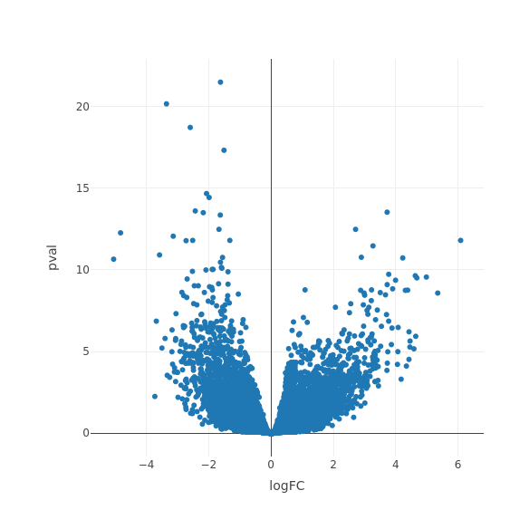

```r
g <- ggplot(mpg, aes(displ, hwy, colour = class)) + 
  geom_point()
print(g)
```


```r
ggplotly(g)
```


```
##            logFC  AveExpr         t      P.Value    adj.P.Val        B
## DRG2   -1.625131 4.940562 -13.10553 5.779018e-27 3.189382e-22 50.34912
## FBXO17 -3.359590 4.611806 -12.50957 2.458513e-25 6.784144e-21 46.66785
## EFEMP2 -2.595368 6.732364 -11.91665 1.028093e-23 1.891314e-19 43.23781
## TRIP4  -1.511829 4.269539 -11.35906 3.421398e-22 4.720589e-18 39.61861
## CBR1   -2.073095 6.901892 -10.34570 1.914488e-19 2.113173e-15 33.61102
## ARSD   -1.989320 5.188585 -10.22703 3.993662e-19 3.673437e-15 32.83983
##        Symbol
## DRG2     DRG2
## FBXO17 FBXO17
## EFEMP2 EFEMP2
## TRIP4   TRIP4
## CBR1     CBR1
## ARSD     ARSD
##                                                                                                                                              Links
## DRG2     https://www.ncbi.nlm.nih.gov/gene?term=(DRG2[gene])%20AND%20(Homo%20sapiens[orgn])%20AND%20alive[prop]%20NOT%20newentry[gene]&sort=weight
## FBXO17 https://www.ncbi.nlm.nih.gov/gene?term=(FBXO17[gene])%20AND%20(Homo%20sapiens[orgn])%20AND%20alive[prop]%20NOT%20newentry[gene]&sort=weight
## EFEMP2 https://www.ncbi.nlm.nih.gov/gene?term=(EFEMP2[gene])%20AND%20(Homo%20sapiens[orgn])%20AND%20alive[prop]%20NOT%20newentry[gene]&sort=weight
## TRIP4   https://www.ncbi.nlm.nih.gov/gene?term=(TRIP4[gene])%20AND%20(Homo%20sapiens[orgn])%20AND%20alive[prop]%20NOT%20newentry[gene]&sort=weight
## CBR1     https://www.ncbi.nlm.nih.gov/gene?term=(CBR1[gene])%20AND%20(Homo%20sapiens[orgn])%20AND%20alive[prop]%20NOT%20newentry[gene]&sort=weight
## ARSD     https://www.ncbi.nlm.nih.gov/gene?term=(ARSD[gene])%20AND%20(Homo%20sapiens[orgn])%20AND%20alive[prop]%20NOT%20newentry[gene]&sort=weight
##                                                                                                Text
## DRG2     log<sub>2</sub>(fold change): -1.63e+00<br>Adjusted p-value: 3.19e-22<br>Gene symbol: DRG2
## FBXO17 log<sub>2</sub>(fold change): -3.36e+00<br>Adjusted p-value: 6.78e-21<br>Gene symbol: FBXO17
## EFEMP2 log<sub>2</sub>(fold change): -2.60e+00<br>Adjusted p-value: 1.89e-19<br>Gene symbol: EFEMP2
## TRIP4   log<sub>2</sub>(fold change): -1.51e+00<br>Adjusted p-value: 4.72e-18<br>Gene symbol: TRIP4
## CBR1     log<sub>2</sub>(fold change): -2.07e+00<br>Adjusted p-value: 2.11e-15<br>Gene symbol: CBR1
## ARSD     log<sub>2</sub>(fold change): -1.99e+00<br>Adjusted p-value: 3.67e-15<br>Gene symbol: ARSD
##                 Group
## DRG2   Down-regulated
## FBXO17 Down-regulated
## EFEMP2 Down-regulated
## TRIP4  Down-regulated
## CBR1   Down-regulated
## ARSD   Down-regulated
```

```r
plot_ly(GBMtopTable, x = ~logFC, y = ~pval, type = "scatter", mode="markers")
```



## 3D scatterplot 

```r
df <- data.frame(z = rnorm(100))
df$y <- df$z * 1.5 + rnorm(100, 1, 0.5)
df$x <- df$y * 3 + rnorm(100, 1, 5)
plot_ly(df, 
    x = ~ x, 
    y = ~ y, 
    z = ~ z, 
    type = "scatter3d", 
    mode = "markers", 
    marker = list(size=2))
```


